# Patents Analyzer — Pipeline Explained

A plain-English walkthrough of the entire system: how patent PDFs become searchable knowledge, and how questions get answered.

---

## Table of Contents

1. [The Big Picture](#1-the-big-picture)
2. [Data Ingestion Pipeline](#2-data-ingestion-pipeline)
   - [Phase 1: PDF Parsing (Docling)](#phase-1-pdf-parsing-docling)
   - [Phase 2: Chunking (Atomic Units)](#phase-2-chunking-atomic-units)
   - [Phase 3: Entity Extraction](#phase-3-entity-extraction)
   - [Phase 4: Knowledge Graph Construction](#phase-4-knowledge-graph-construction)
   - [Phase 5: Search Index Building](#phase-5-search-index-building)
   - [Output Files](#output-files)
3. [Retrieval — Finding Relevant Chunks](#3-retrieval--finding-relevant-chunks)
   - [BM25 — Exact Word Matching](#bm25--exact-word-matching)
   - [Semantic — Meaning Matching](#semantic--meaning-matching)
   - [Graph — Relationship Walking](#graph--relationship-walking)
   - [Weights — How Much to Trust Each Expert](#weights--how-much-to-trust-each-expert)
   - [RRF — Reciprocal Rank Fusion](#rrf--reciprocal-rank-fusion)
4. [Generation — Producing Answers](#4-generation--producing-answers)
   - [Context Building](#context-building)
   - [Prompt Construction](#prompt-construction)
   - [LLM Call](#llm-call)
   - [Response Structure](#response-structure)
5. [End-to-End Example](#5-end-to-end-example)

---

## 1. The Big Picture

The system has two main flows: **ingestion** (offline, run once) and **retrieval + generation** (online, per question).

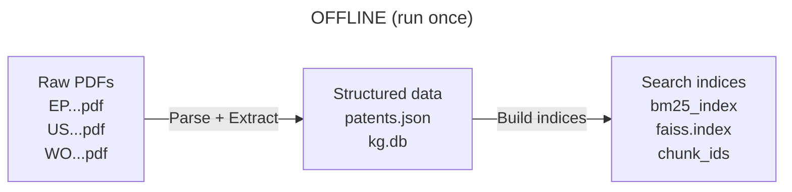

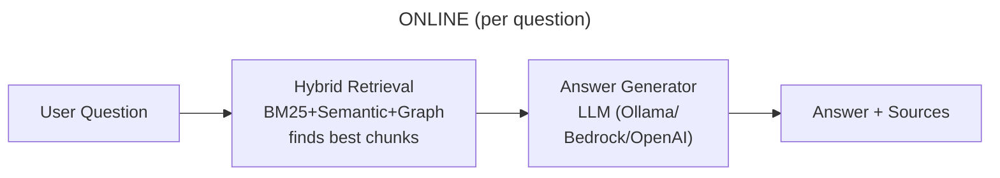

---

## 2. Data Ingestion Pipeline

**Script:** `src/data_ingestion.py`

The pipeline takes raw patent PDFs and produces everything the search system needs. For each PDF, it runs four phases sequentially, then two final phases across all patents:

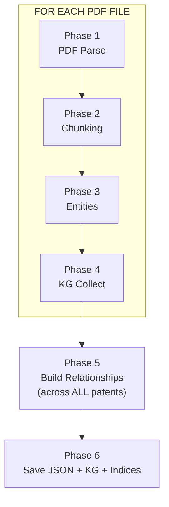

---

### Phase 1: PDF Parsing (Docling)

**File:** `src/extraction/pdf_parser.py`

**What it does:** Takes a raw patent PDF and produces a structured `PatentDocument` with labeled sections and extracted tables.

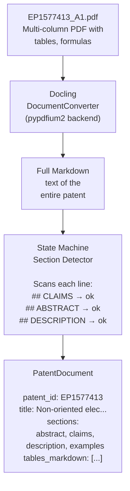

**How the state machine works:**

Docling converts the PDF into Markdown. The state machine then walks through this Markdown line by line. It keeps track of which patent section it's currently "inside." Every time it sees a heading like `## CLAIMS`, it transitions to the new section. All subsequent lines belong to that section until the next heading.

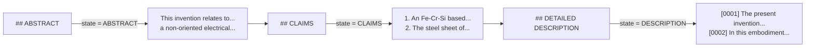

The recognized heading patterns are:

| Heading Pattern | Section |
|---|---|
| `## ABSTRACT` | ABSTRACT |
| `## CLAIMS` | CLAIMS |
| `## BACKGROUND` | BACKGROUND |
| `## DETAILED DESCRIPTION` | DESCRIPTION |
| `## DESCRIPTION` | DESCRIPTION |
| `## SUMMARY` | DESCRIPTION |
| `## FIELD OF...` | BACKGROUND |
| `## EXAMPLES` | EXAMPLES |
| `## EMBODIMENTS` | EMBODIMENTS |
| `## BRIEF DESCRIPTION OF DRAWINGS` | FIGURES |

Lines before the first recognized heading default to `PREAMBLE` (the initial state). The heading line itself is consumed — only content below it is collected.

**Other things that happen in this phase:**
- **Page tracking:** Docling emits page-break placeholders between pages. The state machine counts these to track the current page number and embeds `<!-- PB:N -->` markers into the section text so the chunker can assign correct page numbers to each chunk. Table page numbers are extracted from Docling's provenance data.
- **Noise filter:** Removes page headers (`EP 1 577 413 A1`), page numbers, and blank heading artifacts
- **Table extraction:** Docling detects tables and exports each as a Markdown table
- **Table stitching:** Patent tables often span page breaks, causing Docling to emit two separate tables for one logical table. The `TableStitcher` detects consecutive tables with the same column count and merges them back together

---

### Phase 2: Chunking (Atomic Units)

**File:** `src/chunking/chunker.py`

**What it does:** Splits each section into natural semantic units. Unlike traditional token-based chunking (which cuts at arbitrary positions), this strategy never splits mid-claim or mid-paragraph.

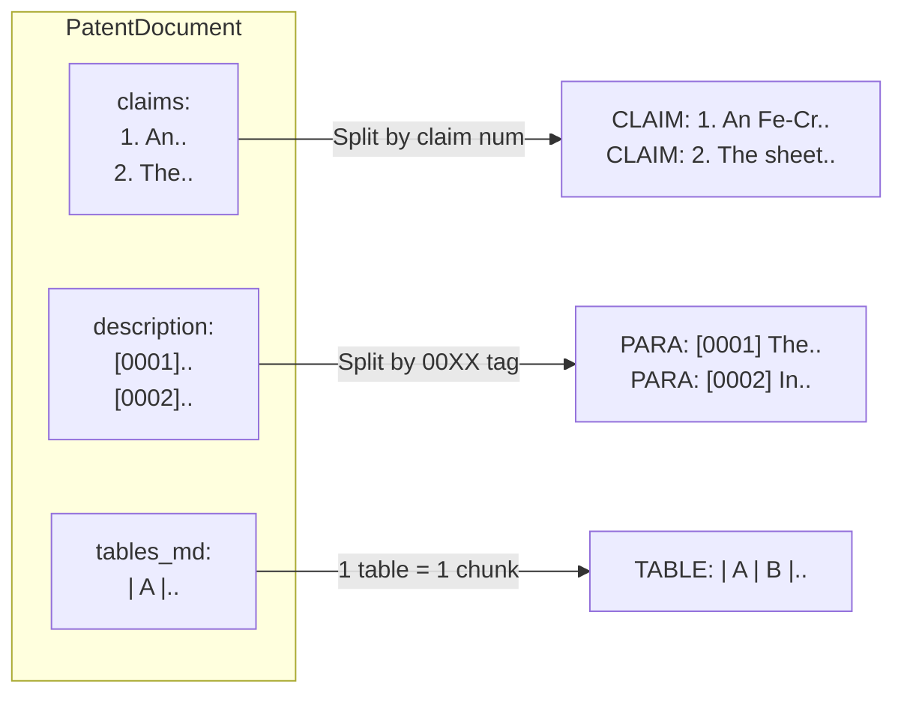

**Chunking rules by section type:**

| Section | Split Strategy | chunk_type |
|---|---|---|
| Claims | Each numbered claim (`1.`, `2.`, ...) is one chunk, never split | `claim` |
| Description, Background, Examples, etc. | Split by `[00XX]` paragraph tags; fallback to blank lines | `paragraph` |
| Tables | Entire Markdown table = one chunk | `table` |
| Paragraphs containing formulas | Same as above, but tagged differently | `formula` |

**Page number assignment:**

Each chunk receives a page number from `<!-- PB:N -->` markers embedded during parsing. The chunker reads the first marker in each paragraph/claim block and propagates it forward — so paragraphs without an explicit marker inherit the page of the previous paragraph. Markers are stripped from chunk content after extraction. Table chunks receive their page numbers directly from Docling's provenance metadata.

**Cross-reference resolution:**

Each chunk also gets its cross-references resolved. If the text says "Table 1", a `StructuredReference` is created mapping it to a patent-scoped ID like `EP1577413_TABLE_01`.

---

### Phase 3: Entity Extraction

**File:** `src/extraction/entity_extractor.py`

**What it does:** Scans each chunk's text with regex patterns to find chemical elements, properties, processes, materials, applications, and references. Optionally uses an LLM (via Instructor) for richer extraction.

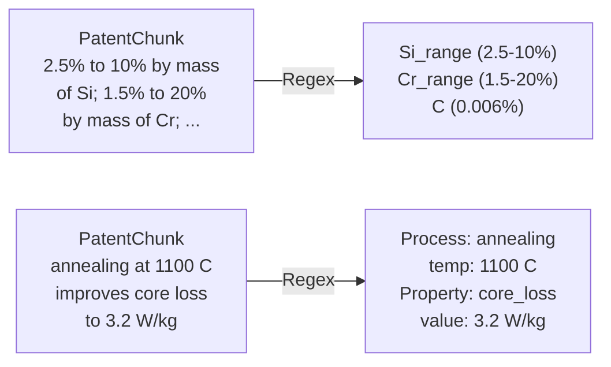

**What gets extracted (16 entity types):**

| Pattern | Example Match | Entity Type |
|---|---|---|
| Element-first value | `Si: 2.5%` | CHEMICAL_ELEMENT |
| Element-first range | `Si: 2.5-10%` | COMPOSITION_RANGE |
| Value-first range (claims) | `2.5% to 10% by mass of Si` | COMPOSITION_RANGE |
| Value-first single (claims) | `0.006% by mass or less of C` | CHEMICAL_ELEMENT |
| Material properties | `yield stress 500 MPa` | PROPERTY |
| Process steps | `annealing at 1100 C` | PROCESS |
| Table references | `Table 1` | TABLE |
| Formula references | `Formula (2)` | FORMULA |
| Figure references | `FIG. 3` | FIGURE |
| Sample identifiers | `Sample A1` | SAMPLE |
| Application domains | `electric vehicle` | APPLICATION |
| Material types | `grain-oriented electrical steel` | MATERIAL |
| Inventor names | (LLM extraction) | INVENTOR |
| Assignee names | (LLM extraction) | ASSIGNEE |
| Cited patents | (LLM extraction) | PATENT_REFERENCE |
| Problems/solutions | (LLM extraction) | PROBLEM / SOLUTION |

**Optional LLM extraction (`--use-llm-extraction`):**

When enabled, the system also calls an LLM (via the `instructor` library) to extract structured `ChunkExtractionResult` objects with compositions, properties, and processes. The LLM results are merged with regex results. This catches things regex misses but costs time and API calls.

---

### Phase 4: Knowledge Graph Construction

**File:** `src/knowledge_graph/builder.py`

**What it does:** After all chunks from a patent are processed, entities are collected into the `KnowledgeGraphBuilder`. Duplicates (same entity appearing in multiple chunks) get their `chunk_ids` merged.

Then, across **all** chunks from **all** patents, the builder infers relationships from co-occurrence:

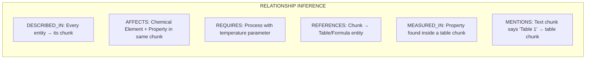

**Example graph fragment:**

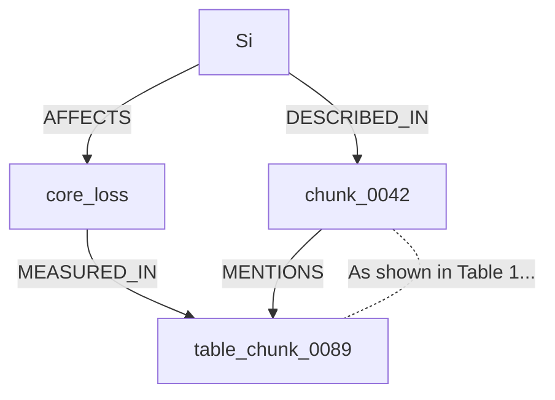

---

### Phase 5: Search Index Building

Two search indices are built from the chunk list:

**BM25 index** (`bm25_index.pkl`):
- Tokenizes every chunk's text with NLTK word tokenizer
- Builds a BM25Okapi model (a statistical keyword-matching algorithm)
- Saved as a serialized file

**FAISS index** (`faiss.index` + `chunk_ids.json`):
- Encodes every chunk's text into a 384-dimensional vector using the `all-MiniLM-L6-v2` sentence-transformer model
- Normalizes vectors for cosine similarity
- Stores in a FAISS flat inner-product index
- Saves a separate JSON mapping from FAISS position to chunk_id

---

### Output Files

```
  data/processed/
  ├── patents.json          Flat list of all chunks + patent summaries
  │   { "patents": [{patent_id, title, num_chunks}],
  │     "chunks": [{chunk_id, patent_id, content,
  │                metadata: {section, page, type},
  │                entities: [...], references: [...]}],
  │     "total_chunks": 405 }
  │
  ├── knowledge_graph.db    SQLite database
  │   ├── entities table:      id, type, name, properties
  │   ├── relationships table: id, type, source_id, target_id
  │   └── chunk_entities:      chunk_id <-> entity_id mapping
  │
  ├── bm25_index.pkl        BM25Okapi model + tokenized corpus
  ├── faiss.index           384-dim normalized vectors
  └── chunk_ids.json        FAISS position -> chunk_id mapping
```

---

### Complete Ingestion Flow Summary

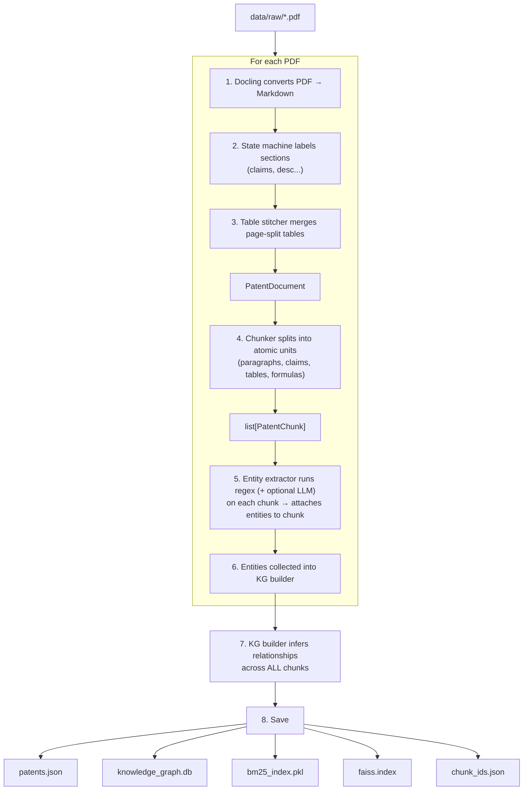

**Running it:**
```bash
# All PDFs in data/raw/
uv run python src/data_ingestion.py

# Specific PDF
uv run python src/data_ingestion.py EP1577413_A1.pdf

# With LLM-enhanced extraction
uv run python src/data_ingestion.py --use-llm-extraction
```

Typical output for one patent: ~400 chunks, ~20-50 entities, ~200 relationships.

---

## 3. Retrieval — Finding Relevant Chunks

When you ask a question, the system needs to find the most relevant chunks from `patents.json`. It runs **three completely different search strategies** in parallel, then combines their results.

Think of it like asking three different experts the same question. Each one finds answers using a different method:

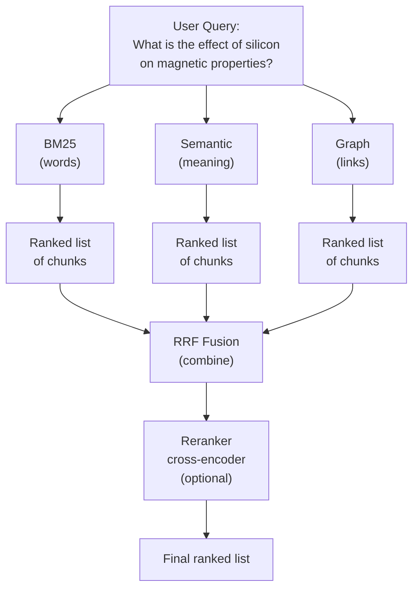

---

### BM25 — Exact Word Matching

**File:** `src/retrieval/bm25_retriever.py`

**What it does:** Counts how many of your query words appear in each chunk, weighted by how rare those words are.

**How it thinks:** "The user said 'silicon'. Let me find every chunk that literally contains the word 'silicon'. Chunks where 'silicon' appears more often, and where 'silicon' is a rare word in the overall corpus, get higher scores."

```
  Query: "effect of silicon on magnetic properties"
                    │
                    ▼
  Tokenize: ["effect", "of", "silicon", "on", "magnetic", "properties"]
                    │
                    ▼
  Score every chunk by word overlap:

  Chunk 0042: "silicon content of 3.2% improves magnetic flux..."
              has "silicon", "magnetic"              Score: 8.7

  Chunk 0089: "Table 1 shows magnetic properties for various..."
              has "magnetic", "properties"           Score: 5.2

  Chunk 0003: "the annealing temperature was set to 1100 C..."
              no matching words                      Score: 0.1
```

**Good at:** Finding chunks with exact technical terms — chemical symbols like "Si", specific values like "3.2 W/kg", precise terminology.

**Bad at:** Understanding that "silicon" and "Si" mean the same thing, or that "improves core loss" is related to "magnetic properties."

---

### Semantic — Meaning Matching

**File:** `src/retrieval/semantic_retriever.py`

**What it does:** Converts both the query and every chunk into 384-dimensional vectors (using the `all-MiniLM-L6-v2` neural network), then finds chunks whose vectors are closest to the query vector using FAISS.

**How it thinks:** "I don't care about exact words. I understand that 'effect of silicon on magnetic properties' *means something*. Let me find chunks that talk about *similar things*, even if they use completely different words."

```
  Query: "effect of silicon on magnetic properties"
                    │
                    ▼
  Encode into 384-dim vector: [0.12, -0.34, 0.56, ...]
                    │
                    ▼
  Find nearest vectors in FAISS index:

  Chunk 0042: "Si content affects core loss and B8 values..."
              talks about same concept              Cosine: 0.87

  Chunk 0015: "adding Si reduces iron loss in the steel..."
              same topic, different words            Cosine: 0.81

  Chunk 0200: "chromium improves corrosion resistance..."
              different topic entirely               Cosine: 0.23
```

**Good at:** Understanding synonyms and paraphrases. "Si" = "silicon", "core loss" relates to "magnetic properties", "iron loss" = "core loss".

**Bad at:** Specific numeric values. It won't distinguish "3.2% Si" from "6.5% Si" — they look similar in vector space.

---

### Graph — Relationship Walking

**File:** `src/retrieval/graph_retriever.py`

**What it does:** Extracts entities from your query, finds them in the knowledge graph, then walks along the graph edges (relationships) to find connected chunks.

**How it thinks:** "The user mentioned 'silicon' and 'magnetic properties'. I know from the knowledge graph that Silicon AFFECTS core_loss, and core_loss is MEASURED_IN Table 3. Let me follow those links to find relevant chunks."

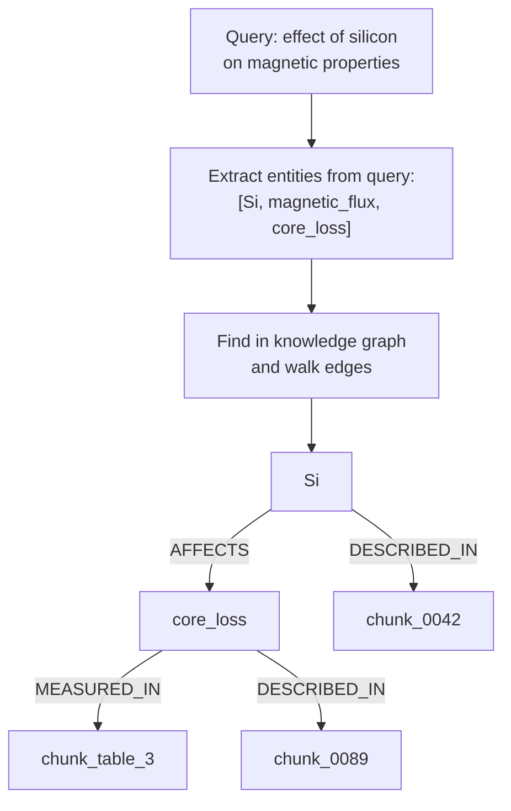

Walk graph (BFS, up to 2 hops):

```
  Hop 0 (direct):  chunks containing Si         -> score 1.0
  Hop 1 (1 away):  chunks linked to Si's chunk  -> score 0.5  (decayed)
  Hop 2 (2 away):  chunks 2 links away          -> score 0.25 (decayed more)
```

The score decays exponentially with distance: `score = 0.5 ^ hop_count`. Direct matches get 1.0, one hop away gets 0.5, two hops gets 0.25.

**Good at:** Finding chunks that are *structurally* related — a table that contains measurements for an element mentioned in your query, even if the table text doesn't contain the word "silicon" at all.

**Bad at:** Queries about topics where no entities were extracted (generic questions, conceptual queries without chemical symbols or property names).

---

### Weights — How Much to Trust Each Expert

The weights control how much each retriever's opinion matters in the final combined score:

```
  Default weights (from .env.example):

  BM25:      1.0  (full trust)
  Semantic:  1.0  (full trust)
  Graph:     1.2  (slightly boosted)
```

**Why these weights?** BM25 and Semantic each contribute complementary strengths. Graph gets a slight boost (1.2) because when entities are found in the query, the knowledge graph traversal provides highly relevant structural connections that the other retrievers miss.

**What the weight does concretely:** It multiplies the retriever's RRF score contribution:

```
  If BM25  ranks a chunk #1:  contribution = 1.0 x 1/(60+1) = 0.01639
  If Semantic ranks it #3:    contribution = 1.0 x 1/(60+3) = 0.01587
  If Graph ranks it #5:       contribution = 1.2 x 1/(60+5) = 0.01846
                                                               ───────
                                               Total RRF score: 0.05072
```

Higher weight = that retriever has more influence on the final ranking.

---

### RRF — Reciprocal Rank Fusion

**File:** `src/retrieval/hybrid_retriever.py`

RRF is the formula that merges three ranked lists into one final ranking. The key idea:

> **It doesn't care about raw scores. It only cares about rank position.**

Why? Because BM25 scores might be 0-15, semantic scores might be 0.0-1.0, and graph scores might be 0-5. You can't add those directly — they're on completely different scales. But rank #1 means "best result" in every retriever. So RRF works with ranks instead.

**The formula:**

```
  RRF_score(chunk) = weight_bm25  x 1/(k + rank_bm25)
                   + weight_sem   x 1/(k + rank_semantic)
                   + weight_graph x 1/(k + rank_graph)

  where k = 60 (a smoothing constant)
```

**Worked example:**

```
  Query: "effect of silicon on magnetic properties"

  BM25 returns:       Semantic returns:     Graph returns:
  #1  chunk_0042      #1  chunk_0015        #1  chunk_0042
  #2  chunk_0089      #2  chunk_0042        #2  chunk_0089
  #3  chunk_0015      #3  chunk_0055        #3  chunk_0033
  #4  chunk_0100      #4  chunk_0089
```

Calculate RRF for each chunk:

```
  chunk_0042:
    BM25 rank #1:      1.0 x 1/(60+1) = 0.01639
    Semantic rank #2:   1.0 x 1/(60+2) = 0.01613
    Graph rank #1:      1.2 x 1/(60+1) = 0.01967
                                  Total = 0.05219  <-- HIGHEST

  chunk_0089:
    BM25 rank #2:      1.0 x 1/(60+2) = 0.01613
    Semantic rank #4:   1.0 x 1/(60+4) = 0.01563
    Graph rank #2:      1.2 x 1/(60+2) = 0.01935
                                  Total = 0.05111

  chunk_0015:
    BM25 rank #3:      1.0 x 1/(60+3) = 0.01587
    Semantic rank #1:   1.0 x 1/(60+1) = 0.01639
    Graph: not found                    = 0.00000
                                  Total = 0.03226

  chunk_0055:
    BM25: not found                     = 0.00000
    Semantic rank #3:   1.0 x 1/(60+3) = 0.01587
    Graph: not found                    = 0.00000
                                  Total = 0.01587
```

**Final ranking:**
```
  #1  chunk_0042  (0.05219)  <-- found by ALL THREE retrievers
  #2  chunk_0089  (0.05111)  <-- found by all three
  #3  chunk_0015  (0.03226)  <-- found by BM25 + Semantic
  #4  chunk_0055  (0.01587)  <-- found by Semantic only
```

**The key insight: chunks found by multiple retrievers bubble to the top.** A chunk that's rank #1 in just one retriever will lose to a chunk that's rank #2 in all three. This is why hybrid retrieval works better than any single method alone.

**Why k = 60?**

The constant `k` in the denominator `1/(k + rank)` controls how much the top positions matter:

```
  With k = 60:
    Rank #1:  1/61 = 0.01639
    Rank #2:  1/62 = 0.01613   <-- only 1.6% less than #1
    Rank #30: 1/90 = 0.01111   <-- still 68% of #1's score

  With k = 1 (hypothetical):
    Rank #1:  1/2 = 0.500
    Rank #2:  1/3 = 0.333      <-- 33% less than #1
    Rank #30: 1/31 = 0.032     <-- only 6% of #1's score
```

A large `k` (60) flattens the rank differences — rank #1 and rank #5 get almost the same score. This means the system values *being found at all* more than *being found first*. That's good because the individual retrievers each have their own biases about what's "first."

---

## 4. Generation — Producing Answers

**Files:** `src/llm/answer_generator.py`, `src/llm/llm_client.py`

Once retrieval finds the best chunks, the generation step feeds them to an LLM to produce a human-readable answer.

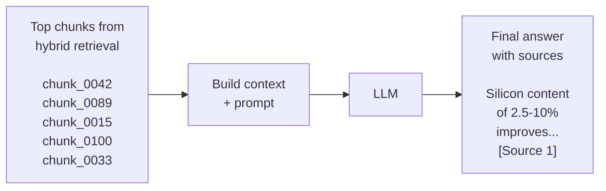

The generation pipeline has three steps:

---

### Context Building

The top chunks (default: 5) are formatted into a context string. Each chunk gets a `[Source N]` label and its metadata:

```
  [Source 1] (Patent: EP1577413, Section: description, Page: 5)
  [0042] Silicon content of 3.2% by mass significantly improves
  the magnetic flux density B8 to values above 1.89 T...

  [Source 2] (Patent: EP1577413, Section: examples, Page: 12)
  Table 3 shows the measured core loss values for samples with
  varying Si content from 2.5% to 6.5%...

  [Source 3] (Patent: EP1577413, Section: claims, Page: 1)
  1. An Fe-Cr-Si based non-oriented electrical steel sheet
  comprising 2.5% to 10% by mass of Si...
```

---

### Prompt Construction

The context and the user's question are assembled into a structured prompt with instructions:

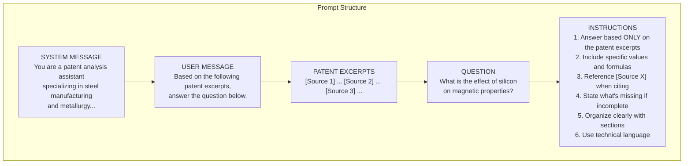

The key instruction is #1: **answer based ONLY on the provided excerpts**. This is what makes it RAG (Retrieval-Augmented Generation) — the LLM doesn't make things up from general knowledge, it cites from the actual patent text.

---

### LLM Call

The prompt is sent to whichever LLM provider is configured via `LLMClient`:

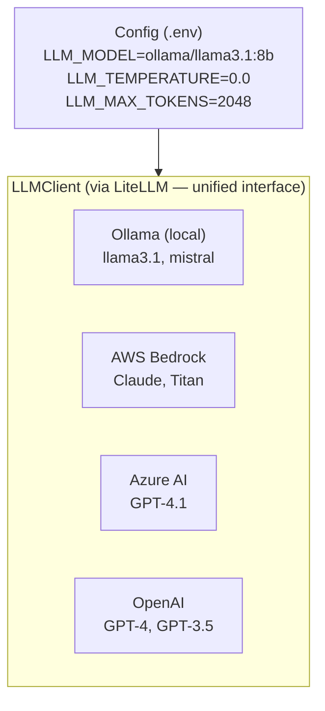

Temperature is set to 0.0 by default — the LLM gives the most deterministic, factual response. Streaming is supported for real-time output in the UI.

---

### Response Structure

The generator returns a structured result:

```json
{
  "answer": "Silicon content significantly affects magnetic properties...",
  "sources": [
    {
      "chunk_id": "EP1577413_0042",
      "patent_id": "EP1577413",
      "section": "description",
      "page": 5,
      "rrf_score": 0.04072,
      "preview": "[0042] Silicon content of 3.2% by mass..."
    }
  ],
  "metadata": {
    "model": "ollama/llama2",
    "chunk_count": 5,
    "total_retrieved": 30,
    "temperature": 0.0
  }
}
```

The answer includes source citations (`[Source 1]`, `[Source 2]`), and the `sources` list lets the UI show exactly which patent chunks were used and where they came from.

**Additional generation modes:**

| Mode | What it does |
|---|---|
| `generate_answer()` | Standard Q&A with sources |
| `generate_summary()` | Summarize key technical info from chunks |
| `generate_comparison()` | Compare two sets of chunks (e.g., two different patents) |
| `stream_answer()` | Same as generate_answer but yields tokens for real-time UI display |

---

## 5. End-to-End Example

Here's what happens when you ask: **"What is the effect of silicon on magnetic properties?"**

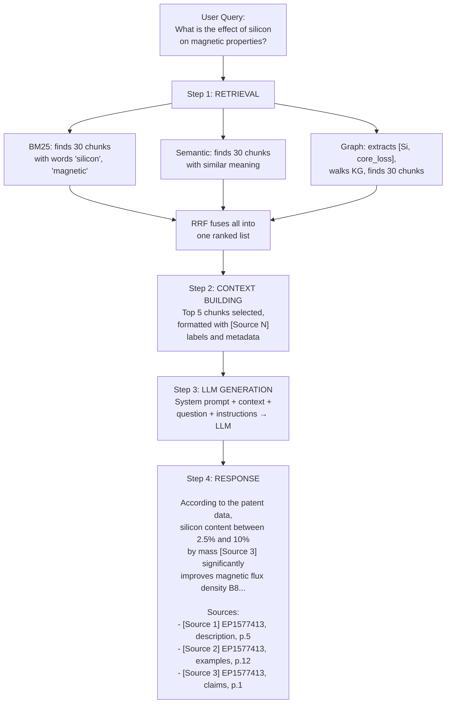
